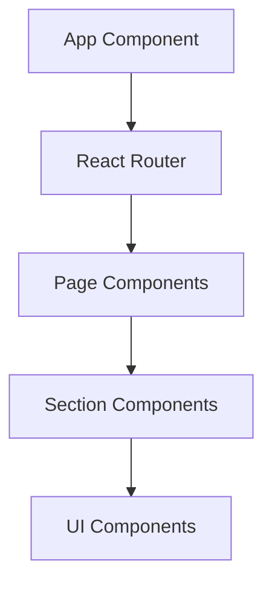

# System Patterns

## Architecture
- React frontend with Vite build system
- TypeScript for type safety
- Component-based UI architecture
- Tailwind CSS for styling

## Key Technical Decisions
1. **State Management**: Using React context + hooks
2. **Routing**: React Router
3. **Internationalization**: React-i18next
4. **API Communication**: Axios with interceptors

## Component Relationships

## Critical Paths
1. Partnership exploration flow
2. Capability showcase rendering
3. Contact management system

## Interactive Component Patterns
### Map Integration
- MapBox with custom styling layers
- Cluster markers for partner locations
- Region-specific overlays

### Data Visualization
- D3.js for complex charts
- Responsive SVG components
- Animated transitions

### Timeline Components
- Horizontal scrolling timeline
- Event grouping by category
- Media integration (images/videos)

### Animation System
- SVG path animations
- Scroll-triggered sequences
- Micro-interactions for UX feedback
