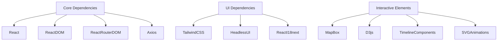

# Technical Context

## Core Technologies
- **Frontend**: React 18, TypeScript 5
- **Build**: Vite 4
- **Styling**: Tailwind CSS 3
- **Testing**: Jest, React Testing Library

## Development Setup
- Node.js v18+
- npm v9+
- VS Code recommended
- ESLint + Prettier configured

## Dependencies

## Interactive Features
- **Map Integration**: MapBox with custom styling
- **Data Visualization**: D3.js for complex charts
- **Timelines**: Custom interactive timeline components  
- **Animations**: SVG-based process demonstrations
- **Micro-interactions**: Hover/click feedback

## Tool Usage Patterns
- `npm run dev`: Start development server
- `npm run build`: Production build
- `npm run lint`: Run linter
- `npm run test`: Run tests
